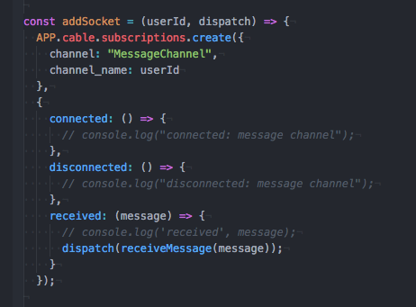
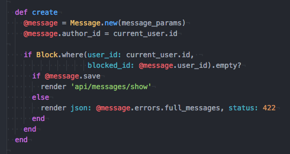

# NightlifeSF
Changing the way you find where to go out at night.

NightlifeSF is an interactive mobile app built with React-Naive and Rails. Used to find the best nightlife in SF.

Coming soon to the App Store and Play Store.

## Design

### Real-time

I setup in app messaging and notifications in real-time using a websocket connection, connecting the mobile app to the server using Rails Action Cable.

### Block Users

I added the ability to block users by adding a check to the create actions of both the messages and friendships controllers. It queries the database to check if the current user has been blocked by the user they are attempting to contact. If not, they are permitted to message or send a friend request to the targeted user.

